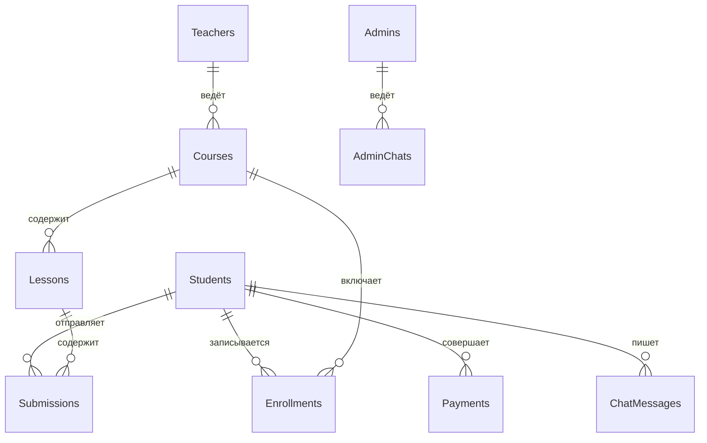

# 📚 EduFlow — LMS (Learning Management System)

**EduFlow** — платформа для онлайн-обучения, разработанная как пет-проект для демонстрации навыков системного анализа и проектирования API.

---

## 🎯 О проекте

Платформа позволяет студентам записываться на курсы, оплачивать их (полностью или в рассрочку), сдавать домашние задания, общаться с преподавателями и администраторами.

Преподаватели могут проверять работы, выставлять оценки, оставлять замечания и открывать студентам чаты с администрацией.

Администраторы управляют пользователями, обрабатывают баг-репорты и утверждают изменения в курсах.

---

## 👥 Роли в системе

| Роль | Описание |
|:-----|:---------|
| **Студент** | Регистрация, запись на курсы, оплата, сдача ДЗ, чаты |
| **Преподаватель** | Ведение курсов, проверка ДЗ, выставление оценок |
| **Администратор** | Управление пользователями, баг-репорты, утверждение изменений |

---

## 📋 Бизнес-требования

| Цель | Значение |
|:-----|:---------|
| **Целевая аудитория** | Люди, желающие обучаться IT-специальностям |
| **Бизнес-цель** | Занять 8% рынка онлайн-образования в первый квартал |
| **Монетизация** | Продажа курсов, рассрочка, B2B-интеграция с учебными заведениями |
| **Ключевые возможности** | Регистрация, оплата, ДЗ, чаты, уведомления |

---

## Архитектура проекта

### ER-диаграмма

## API Эндпоинты

Базовый URL: `https://api.eduflow.com/v1`

### Аутентификация 

| Метод | Путь | Описание | JWT |
|:------|:-----|:---------|:----------:|
| `POST` | `/auth/register` | Регистрация нового пользователя | ❌ |
| `POST` | `/auth/login` | Вход (выдача JWT) | ❌ |
| `POST` | `/auth/logout` | Выход из системы | ✅ |
| `GET` | `/auth/me` | Получить свой профиль | ✅ |
| `PATCH` | `/auth/me` | Обновить свой профиль | ✅ |

---

### Студент 

| Метод | Путь | Описание | JWT |
|:------|:-----|:---------|:----------:|
| `GET` | `/student/courses` | Список курсов студента | ✅ |
| `POST` | `/student/courses/{course_id}/enroll` | Записаться на курс | ✅ |
| `DELETE` | `/student/courses/{course_id}/enroll` | Отписаться от курса | ✅ |
| `POST` | `/student/courses/{course_id}/freeze` | Заморозить курс | ✅ |
| `POST` | `/student/courses/{course_id}/feedback` | Оставить отзыв на курс | ✅ |
| `GET` | `/student/payments` | История платежей | ✅ |
| `GET` | `/student/submissions` | Список своих ДЗ | ✅ |
| `GET` | `/student/notifications` | Список уведомлений | ✅ |

---

### Преподаватель 

| Метод | Путь | Описание | JWT |
|:------|:-----|:---------|:----------:|
| `GET` | `/teacher/courses` | Список своих курсов | ✅ |
| `POST` | `/teacher/courses` | Создать курс | ✅ |
| `PATCH` | `/teacher/courses/{course_id}` | Обновить курс | ✅ |
| `DELETE` | `/teacher/courses/{course_id}` | Удалить курс | ✅ |
| `GET` | `/teacher/courses/{course_id}/students` | Студенты курса | ✅ |
| `GET` | `/teacher/courses/{course_id}/statistics` | Статистика курса | ✅ |
| `POST` | `/teacher/courses/{course_id}/complete` | Завершить курс | ✅ |
| `GET` | `/teacher/submissions` | ДЗ на проверку | ✅ |
| `GET` | `/teacher/submissions/{submission_id}` | ДЗ студента по ID | ✅ |
| `PATCH` | `/teacher/submissions/{submission_id}/grade` | Выставить оценку | ✅ |
| `PATCH` | `/teacher/submissions/{submission_id}/feedback` | Замечания | ✅ |

---

### Администратор 

| Метод | Путь | Описание | JWT |
|:------|:-----|:---------|:----------:|
| `GET` | `/admin/students` | Список всех студентов | ✅ |
| `PATCH` | `/admin/students/{student_id}/block` | Блокировка студента | ✅ |
| `PATCH` | `/admin/students/{student_id}/unblock` | Разблокировка студента | ✅ |
| `PATCH` | `/admin/students/{student_id}/reset-password` | Сброс пароля | ✅ |
| `GET` | `/admin/bug-reports` | Список баг-репортов | ✅ |
| `PATCH` | `/admin/bug-reports/{bug_id}/resolve` | Закрыть баг-репорт | ✅ |

---

### Курсы 

| Метод | Путь | Описание | JWT |
|:------|:-----|:---------|:----------:|
| `GET` | `/courses` | Список всех курсов | ❌ |
| `GET` | `/courses/{course_id}` | Детали курса | ❌ |
| `GET` | `/courses/{course_id}/lessons` | Уроки курса | ❌ |

---

### Домашние задания 

| Метод | Путь | Описание | JWT |
|:------|:-----|:---------|:----------:|
| `POST` | `/submissions` | Отправить ДЗ | ✅ |
| `PATCH` | `/submissions/{submission_id}` | Исправить ДЗ | ✅ |
| `GET` | `/submissions/{submission_id}` | Посмотреть ДЗ | ✅ |
| `GET` | `/submissions/{submission_id}/status` | Статус проверки | ✅ |
| `GET` | `/submissions/{submission_id}/grade` | Узнать оценку | ✅ |

---

### Оплата 

| Метод | Путь | Описание | JWT |
|:------|:-----|:---------|:----------:|
| `POST` | `/payments` | Создать платёж (ссылка на оплату) | ✅ |
| `GET` | `/payments/{payment_id}/status` | Статус платежа (Polling) | ✅ |
| `POST` | `/payments/{payment_id}/refund` | Возврат средств | ✅ |

---

### Чаты (Chats)

| Метод | Путь | Описание | JWT |
|:------|:-----|:---------|:----------:|
| `POST` | `/chats` | Создать чат с преподавателем | ✅ |
| `GET` | `/chats/{chat_id}/messages` | Сообщения чата | ✅ |
| `POST` | `/chats/{chat_id}/messages` | Отправить сообщение | ✅ |
| `POST` | `/teacher/chat-requests` | Запрос на чат с админом | ✅ |
| `GET` | `/admin/chat-requests` | Список запросов (админ) | ✅ |
| `PATCH` | `/admin/chat-requests/{request_id}/approve` | Одобрить запрос | ✅ |
| `PATCH` | `/admin/chats/{chat_id}/close` | Закрыть чат | ✅ |
| `GET` | `/admin/chats/{chat_id}/messages` | Сообщения чата с админом | ✅ |
| `POST` | `/admin/chats/{chat_id}/messages` | Ответ админа | ✅ |

---

### Webhook

| Метод | Путь | Описание | JWT |
|:------|:-----|:---------|:----------:|
| `POST` | `/webhooks/payments` | Webhook от платёжного шлюза | ❌ |
